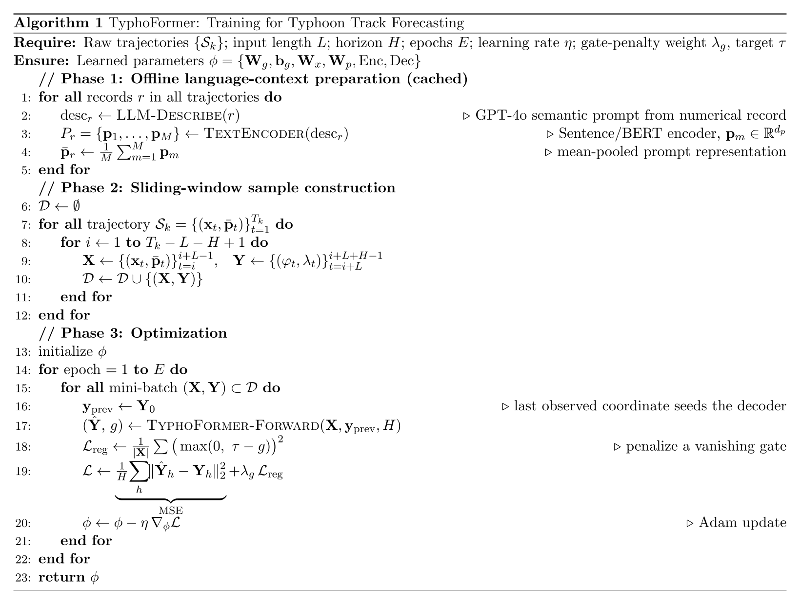
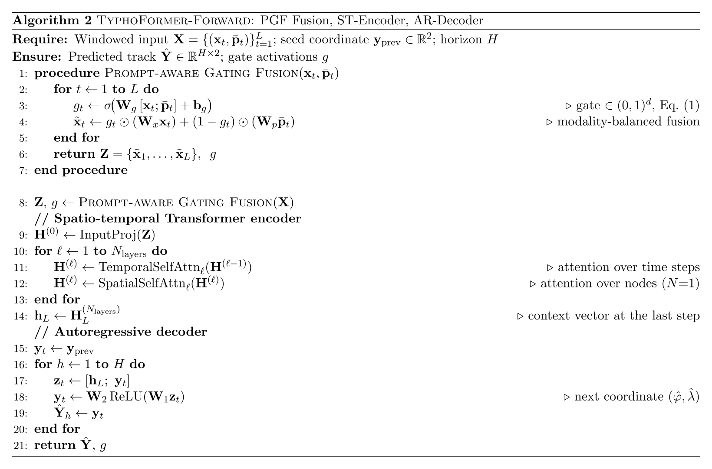

# TyphoFormer

### 🌀 Language-Augmented Transformer for Accurate Typhoon (Hurricane) Track Forecasting

[](https://arxiv.org/abs/2506.17609)
[](https://doi.org/10.1145/3748636.3763223)

[](https://pytorch.org/)


---

> **Official implementation of [TyphoFormer: Language-Augmented Transformer for Accurate Typhoon Track Forecasting](https://arxiv.org/abs/2506.17609)** (Li *et al.*, ACM SIGSPATIAL 2025) — winner of the 🏆 **Best Short Paper Award**. TyphoFormer augments a spatio-temporal Transformer with LLM-generated natural-language prompts that encode high-level meteorological semantics, fusing them into the numerical trajectory through a **Prompt-aware Gating Fusion (PGF)** module. On the **HURDAT2** benchmark it consistently outperforms classical (CLIPER) and deep-learning baselines (LSTM, GRU, Informer, Autoformer, TSMixer) across all 6 / 12 / 18 / 24-hour horizons, reaching a spherical-distance error of **31.5 km at 6 h** (≈12% lower than the strongest baseline) while holding its lead under nonlinear path shifts and sparse historical observations.

**What is TyphoFormer?** For each time step, a Large Language Model turns raw numerical attributes — position, maximum sustained wind, central pressure, and wind radii — into a concise natural-language description; a sentence encoder embeds it, and the **PGF** module adaptively balances how much language context versus numerical signal to trust at each step. A spatio-temporal Transformer encoder then models long-range temporal dependencies before an autoregressive decoder rolls out future latitude/longitude coordinates.

## 🫶 How to Cite:
> If you find our work useful, please kindly cite our paper, thank you for your appreciation!

```
@inproceedings{lityphoformer2025,
author = {Li, Lincan and Ozguven, Eren Erman and Zhao, Yue and Wang, Guang and Xie, Yiqun and Dong, Yushun},
title = {TyphoFormer: Language-Augmented Transformer for Accurate Typhoon Track Forecasting},
booktitle={33rd ACM SIGSPATIAL International Conference on Advances in Geographic Information Systems (ACM SIGSPATIAL 2025)},
location = {Minnesota, MN, USA},
url = {https://doi.org/10.1145/3748636.3763223},
year = {2025}
}
```

## 🧭 1.Project Overview
> TyphoFormer is a hybrid multi-modal Transformer designed for tropical cyclone (other names: Hurricane, Typhoon) track prediction. It integrates `numerical meteorological features` and `LLM-augmented language embeddings` through a Prompt-aware Gating Fusion (PGF) module, followed by a spatio-temporal Transformer backbone and autoregressive decoding for track forecasting.


## 🧠 2.Model Algorithm (Pseudocode)

> The pseudocode below summarizes the full TyphoFormer pipeline. The LaTeX source (paper-style `algorithmicx`) is available in [`TyphoFormer_algorithm.tex`](TyphoFormer_algorithm.tex) for direct reuse in a paper.

### Training

<p align="center">
  <picture>
    <source srcset="assets/algorithm1_training.svg" type="image/svg+xml">
    
  </picture>
</p>

**Algorithm 1** describes the end-to-end training recipe:
- **Phase 1 — Language context (offline, cached).** For each record, GPT-4o produces a natural-language description (`generate_text_description_new.py`); a sentence encoder (`all-MiniLM-L6-v2`) turns it into token embeddings (`generate_text_embeddings.py`); the tokens are mean-pooled into a single prompt vector $\bar{p}$.
- **Phase 2 — Sliding windows.** Each trajectory is sliced into `(INPUT_LEN=L, PRED_LEN=H)` samples (`prepare_typhoformer_data.py`).
- **Phase 3 — Optimization.** The model minimizes an MSE loss on the predicted `(lat, lon)` plus a gate-regularization term $\lambda_g\,(\max(0,\tau-g))^2$ that discourages the fusion gate from collapsing ($\tau{=}0.6$, $\lambda_g{=}0.1$ in `train_typhoformer.py`).

### Forward Pass

<p align="center">
  <picture>
    <source srcset="assets/algorithm2_forward.svg" type="image/svg+xml">
    
  </picture>
</p>

**Algorithm 2** details a single forward pass through the three model modules (`model/`):
- **Prompt-aware Gating Fusion (PGF).** Computes a per-timestep gate $g_t=\sigma(W_g[x_t;\bar{p}_t]+b_g)$ and blends the projected numerical and textual features, $\tilde{x}_t=g_t\odot W_x x_t+(1-g_t)\odot W_p\bar{p}_t$ (Eq. 1 in the paper). This lets the model modulate how much language context to trust at each step (`model/PGF_module.py`).
- **Spatio-temporal encoder.** Applies alternating temporal and spatial self-attention over $N_{\text{layers}}$ blocks — the single-track setting uses $N{=}1$ node — producing a context vector $h_L$ at the last step (`model/STTransformer.py`).
- **Autoregressive decoder.** Rolls out $H$ future coordinates, feeding each prediction back together with $h_L$ (`TyphoDecoder` in `model/TyphoFormer.py`).

### Data-Flow Diagram

The diagram below renders the same two algorithms as a single end-to-end data flow — from raw records to the optimizer — with each stage color-coded by module.

```mermaid
flowchart TD
    subgraph PREP["Phase 1 · Language Context (offline, cached)"]
        R["Typhoon record x_t"] --> G["GPT-4o<br/>semantic prompt"]
        G --> TE["Sentence encoder<br/>all-MiniLM-L6-v2"]
        TE --> MP["Mean-pool tokens<br/>p&#772; = (1/M) &#931; p_m"]
    end

    X["Numerical features x_t"] --> CAT
    MP --> CAT

    subgraph PGF["Prompt-aware Gating Fusion (PGF)"]
        CAT["Concat [x_t ; p&#772;]"] --> GATE["Gate<br/>g = &#963;(W_g[x_t;p&#772;] + b_g)"]
        GATE --> BLEND["x&#771;_t = g &#8857; W_x x_t<br/>+ (1 &#8722; g) &#8857; W_p p&#772;"]
    end

    subgraph ENC["Spatio-Temporal Transformer Encoder (x N_layers)"]
        IP["Input projection"] --> TA["Temporal self-attention"]
        TA --> SA["Spatial self-attention"]
        SA --> HL["Context vector h_L"]
    end

    subgraph DEC["Autoregressive Decoder (h = 1..H)"]
        LOOP["z = [h_L ; y_prev]<br/>y = W_2 ReLU(W_1 z)<br/>feed y back as y_prev"] --> YHAT["Predicted track Y&#770; (lat, lon)"]
    end

    BLEND -->|"Z = x&#771;_1..x&#771;_L"| IP
    HL --> LOOP
    YSEED["Last observed coord y_prev"] --> LOOP

    YHAT --> LOSS["Loss = MSE(Y&#770;, Y)<br/>+ &#955;_g (max(0, &#964; &#8722; g))&#178;"]
    GATE -.->|"gate g"| LOSS
    LOSS --> OPT["Adam update &#966;"]

    classDef prep fill:#eef6ff,stroke:#4a90d9,color:#0b3d66;
    classDef fuse fill:#eafaf1,stroke:#27ae60,color:#145a32;
    classDef enc fill:#fef9e7,stroke:#d4ac0d,color:#7d6608;
    classDef dec fill:#fdedec,stroke:#e74c3c,color:#78281f;
    classDef train fill:#f4ecf7,stroke:#8e44ad,color:#4a235a;
    class R,G,TE,MP prep;
    class CAT,GATE,BLEND fuse;
    class IP,TA,SA,HL enc;
    class LOOP,YHAT dec;
    class LOSS,OPT train;
```



**Reading the diagram.** Numerical features $x_t$ and the mean-pooled prompt vector $\bar{p}$ meet at the **PGF** block (green), where a sigmoid gate $g$ decides — per time step — how much of each modality to keep. The fused sequence $Z$ flows through the **spatio-temporal encoder** (yellow), whose alternating temporal/spatial attention yields the context vector $h_L$. The **autoregressive decoder** (red) unrolls $H$ steps, feeding each predicted coordinate back in, to produce the track $\hat{Y}$. During training, both the prediction and the gate $g$ feed the **objective** (purple) — MSE plus the gate-penalty regularizer — which is optimized with Adam.


## 🧱 3.Repository Structure
```bash
TyphoFormer/
├── model/
│   ├── STTransformer.py       # Spatio-Temporal backbone
│   ├── PGF_module.py          # Prompt-aware Gating Fusion module
│   ├── TyphoFormer.py         # TyphoFormer model architecture
│
│
├── data/                      # Processed Typhoon datasets in '.npy' files
│   ├── train/                 # contains `train_part1.zip` and `train_part2.zip`. Unzip and put all `.npy` files under "train" folder directly.
│   ├── val/
│   └── test/                  # contains `test.zip`. Unzip to get all the `.npy` files.
│
├── embedding_chunks/          # LLM generated semantic descriptions are embeded by sentence-transformer
│   ├── emb_chunk_000.npy
│   ├── ......
│   ├── emb_chunk_006.npy ...
│
├── HURDAT_2new_3000.csv       # Raw typhoon dataset, includes 5 years' typhoon data here as an example
├── generate_text_description_new.py   # GPT-based language generation
├── generate_text_embeddings.py        # Embedding generation via MiniLM-L6-v2
├── prepare_typhoformer_data.py        # Dataset preparation script
├── train_typhoformer.py               # Training entry point
├── eval_typhoformer.py                # Evaluation script
└── utils.py
```

## ⚙️ 4. Environment Setup
```
torch >= 2.1.0
transformers
sentence-transformers
openai
tqdm
pandas
numpy
```

## 🧩 5. Data Preparation

(1) Step 1: Use `generate_text_description_new.py` to create GPT-4o enhanced natural language descriptions for each typhoon record. (We already provided the generated language descriptions with this repository).

(2) Step 2: Covert textual descriptions to embeddings using `generate_text_embeddings.py` (model: MiniLM).

(3) Step 3: Combine numerical and textual embeddings into ready-to-use dataset using `prepare_typhoformer_data.py`.

(4) Step 4: The final dataset is stored under:
```
data/train/xxx.npy
data/val/yyy.npy
data/test/zzz.npy
```
### ❗️[NOTICE]

- **In this repository, we already provide five-year ground-truth typhoon records from HURDAT2, and the corresponding GPT-4o generated language descriptions, as well as the MiniLM generated language embeddings for you to try. However, in our own experiments, we use over 20+ years' Typhoon records and LLM-generated natural language descriptions as our database.**

- The raw numerical typhoon records from 2020-2024 is provided in `HURDAT_2new_3000.csv`
- If you want to generate your own language context descriptions using GPTs, make sure you have a valid OpenAI API Key and put it in the `generate_text_description_new.py`.

Each `.npy`file contains one piece of typhoon track record formatted as:
```
data = np.load(path, allow_pickle=True).item()
X = data["input"]
Y = data["target"]
```

## 🚀 6.Training and Evaluation

> 😄 We alrdeay provided a 5-year processed data, which can directly used for model training, so that you can run model training and evaluation directly. 

```bash
# Train
python train_typhoformer.py

# Evaluate
python eval_typhoformer.py

```
>Training logs will be saved automatically under /checkpoints.
> You can adjust model training-related configurations in `train_typhoformer.py`:
```bash
# <Adjustable Configurations>
DATA_DIR = "data"
TRAIN_DIR = os.path.join(DATA_DIR, "train")
VAL_DIR = os.path.join(DATA_DIR, "val")
SAVE_DIR = "checkpoints"

BATCH_SIZE = 8
NUM_EPOCHS = 100
LR = 1e-4
WEIGHT_DECAY = 1e-5
DEVICE = "cuda" if torch.cuda.is_available() else "cpu"
INPUT_LEN = 12
PRED_LEN = 1
D_NUM = 14
D_TEXT = 384 #dim of language embedding (all-MiniLM-L6-v2）
```

<p align="center">
  
</p>


## 📊 7.Performance Results


