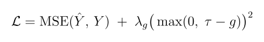
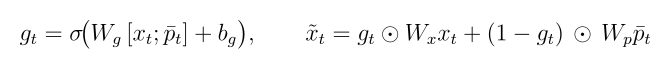
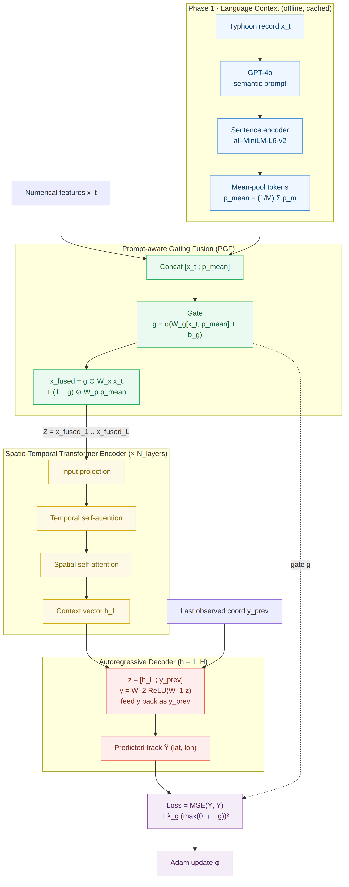
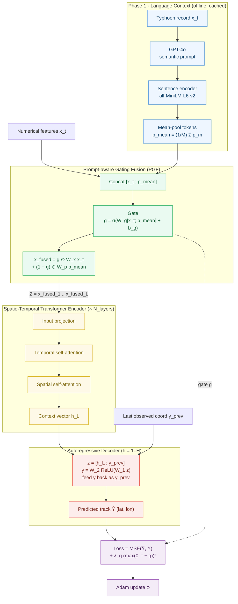

# TyphoFormer

### 🌀 Language-Augmented Transformer for Accurate Typhoon (Hurricane) Track Forecasting

[](https://arxiv.org/abs/2506.17609)
[](https://doi.org/10.1145/3748636.3763223)

[](https://pytorch.org/)


---

> **Official implementation of [TyphoFormer: Language-Augmented Transformer for Accurate Typhoon Track Forecasting](https://arxiv.org/abs/2506.17609)** (Li *et al.*, ACM SIGSPATIAL 2025) — winner of the 🏆 **Best Short Paper Award**. TyphoFormer augments a spatio-temporal Transformer with LLM-generated natural-language prompts that encode high-level meteorological semantics, fusing them into the numerical trajectory through a **Prompt-aware Gating Fusion (PGF)** module. On the **HURDAT2** benchmark it attains the lowest error at *every* forecast horizon (6 / 12 / 18 / 24 h) — e.g. a 6-hour spherical-distance error of **31.5 km** and a 24-hour error of **49.6 km (≈15% below the strongest baseline)** — while degrading far more gracefully over long horizons and under nonlinear path shifts.

**What is TyphoFormer?** For each time step, a Large Language Model turns raw numerical attributes — position, maximum sustained wind, central pressure, and wind radii — into a concise natural-language description; a sentence encoder embeds it, and the **PGF** module adaptively balances how much language context versus numerical signal to trust at each step. A spatio-temporal Transformer encoder then models long-range temporal dependencies before an autoregressive decoder rolls out future latitude/longitude coordinates.

## 📑 Table of Contents

- [✨ Highlights](#-highlights)
- [🧠 Method](#-method)
- [📊 Results](#-results)
- [🚀 Quick Start](#-quick-start)
- [⚡ Pure-C Implementation](#-pure-c-implementation)
- [📁 Repository Structure](#-repository-structure)
- [🧩 Data Preparation](#-data-preparation)
- [🔧 Configuration](#-configuration)
- [📄 Citation](#-citation)
- [🙏 Acknowledgements](#-acknowledgements)
- [📜 License](#-license)

## ✨ Highlights

- **🗣️ Language-augmented forecasting.** Injects per-step, LLM-generated meteorological *prompts* into typhoon-track modeling — supplying context that is inaccessible from numerical features alone.
- **🚪 Prompt-aware Gating Fusion (PGF).** A learned sigmoid gate balances numerical vs. textual signals at *every* time step, rather than naively concatenating the two modalities.
- **🧭 Spatio-temporal Transformer backbone.** Alternating temporal / spatial self-attention followed by an autoregressive decoding head that rolls out future coordinates.
- **🏅 State of the art on HURDAT2.** Lowest MAE **and** spherical-distance error at all 6 / 12 / 18 / 24-hour horizons, with the smallest long-horizon degradation among all baselines.
- **📦 Reproducible out of the box.** Ships 5 years of HURDAT2 records, the GPT-4o prompts, and the MiniLM embeddings — so you can train and evaluate immediately.
- **⚡ Dependency-free pure-C port.** A from-scratch C implementation ([`typhoformer-c/`](typhoformer-c/)) trains and runs with **zero dependencies** (standard library + `libm` only) — no PyTorch, no BLAS — for a lightweight, portable, MIT-licensed build.

## 🧠 Method

TyphoFormer is a hybrid multi-modal Transformer for tropical-cyclone (typhoon / hurricane) track prediction. It integrates `numerical meteorological features` and `LLM-augmented language embeddings` through a **Prompt-aware Gating Fusion (PGF)** module, followed by a spatio-temporal Transformer backbone and autoregressive decoding.

> The pseudocode below summarizes the full pipeline. The LaTeX source (paper-style `algorithmicx`) is available in [`TyphoFormer_algorithm.tex`](TyphoFormer_algorithm.tex) for direct reuse in a paper.

### Training

<p align="center">
  <picture>
    <source srcset="assets/algorithm1_training.svg" type="image/svg+xml">
    
  </picture>
</p>

**Algorithm 1** describes the end-to-end training recipe:
- **Phase 1 — Language context (offline, cached).** For each record, GPT-4o produces a natural-language description (`legacy/generate_text_description_new.py`); a sentence encoder (`all-MiniLM-L6-v2`) turns it into token embeddings (`legacy/generate_text_embeddings.py`); the tokens are mean-pooled into a single prompt vector `p̄`.
- **Phase 2 — Sliding windows.** Each trajectory is sliced into `(INPUT_LEN=L, PRED_LEN=H)` samples (`legacy/prepare_typhoformer_data.py`).
- **Phase 3 — Optimization.** The model minimizes an MSE loss on the predicted `(lat, lon)` plus a gate-regularization term that keeps the fusion gate from collapsing (`τ = 0.6`, `λ_g = 0.1` in `legacy/train_typhoformer.py`):

<p align="center">
  <picture>
    <source srcset="assets/eq_loss.svg" type="image/svg+xml">
    
  </picture>
</p>

### Forward Pass

<p align="center">
  <picture>
    <source srcset="assets/algorithm2_forward.svg" type="image/svg+xml">
    
  </picture>
</p>

**Algorithm 2** details a single forward pass through the three model modules (`legacy/model/`):
- **Prompt-aware Gating Fusion (PGF).** Computes a per-time-step sigmoid gate and blends the projected numerical and textual features (Eq. 1, shown below), letting the model modulate how much language context to trust at each step (`legacy/model/PGF_module.py`).
- **Spatio-temporal encoder.** Applies alternating temporal and spatial self-attention over `N_layers` blocks — the single-track setting uses `N = 1` node — producing a context vector `h_L` at the last step (`legacy/model/STTransformer.py`).
- **Autoregressive decoder.** Rolls out `H` future coordinates, feeding each prediction back together with `h_L` (`TyphoDecoder` in `legacy/model/TyphoFormer.py`).

<p align="center">
  <picture>
    <source srcset="assets/eq_pgf.svg" type="image/svg+xml">
    
  </picture>
</p>

### Data-Flow Diagram

The diagram below renders the same two algorithms as a single end-to-end data flow — from raw records to the optimizer — with each stage color-coded by module.

<p align="center">
  <picture>
    <source srcset="assets/dataflow_diagram.svg" type="image/svg+xml">
    
  </picture>
</p>

<details>
<summary>Mermaid source (click to expand / edit)</summary>



</details>

**Reading the diagram.** Numerical features `x_t` and the mean-pooled prompt vector `p̄` meet at the **PGF** block (green), where a sigmoid gate `g` decides — per time step — how much of each modality to keep. The fused sequence `Z` flows through the **spatio-temporal encoder** (yellow), whose alternating temporal/spatial attention yields the context vector `h_L`. The **autoregressive decoder** (red) unrolls `H` steps, feeding each predicted coordinate back in, to produce the track `Ŷ`. During training, both the prediction and the gate `g` feed the **objective** (purple) — MSE plus the gate-penalty regularizer — which is optimized with Adam.

## 📊 Results

Evaluation on **HURDAT2** (North Atlantic hurricane database; 6-hourly records, 22 meteorological features). Training uses 2004–2021; testing uses 2022–2024. We report **MAE** (mean absolute error, in degrees) and **ΔR** (spherical / great-circle distance error, in km) at 4 forecast horizons. Lower is better; **best per column in bold**.

**Mean Absolute Error (MAE ↓)**

| Model | 6 h | 12 h | 18 h | 24 h |
|:--|:--:|:--:|:--:|:--:|
| CLIPER | 0.235 | 0.275 | 0.310 | 0.368 |
| GRU | 0.367 | 0.405 | 0.493 | 0.640 |
| LSTM | 0.392 | 0.431 | 0.583 | 0.828 |
| Informer | 0.289 | 0.318 | 0.392 | 0.483 |
| Autoformer | 0.263 | 0.286 | 0.357 | 0.433 |
| TSMixer | 0.214 | 0.268 | 0.297 | 0.353 |
| **TyphoFormer** | **0.188** | **0.242** | **0.261** | **0.312** |

**Spherical Distance Error (ΔR, km ↓)**

| Model | 6 h | 12 h | 18 h | 24 h |
|:--|:--:|:--:|:--:|:--:|
| CLIPER | 34.265 | 42.205 | 51.632 | 58.268 |
| GRU | 50.480 | 69.397 | 90.875 | 103.894 |
| LSTM | 46.096 | 71.365 | 95.412 | 112.663 |
| Informer | 37.592 | 46.435 | 56.433 | 76.684 |
| Autoformer | 39.836 | 47.183 | 63.775 | 70.862 |
| TSMixer | 35.720 | 45.265 | 50.330 | 62.910 |
| **TyphoFormer** | **31.539** | **38.084** | **42.435** | **49.562** |

TyphoFormer is best at every horizon and, crucially, degrades the least over time: its 24-hour ΔR of **49.6 km** is ~15% below the strongest baseline (CLIPER, 58.3 km) and ~35% below Informer (76.7 km). The gains persist on the held-out **2024** test year, confirming generalization to recent, unseen storms.

<p align="center">
  
</p>

**Case study — Hurricane MILTON (2024).** TyphoFormer tracks the early recurvature in the Gulf of Mexico, the Florida landfall curvature, and the post-landfall drift into the Atlantic more faithfully than recurrent and Transformer baselines, which tend to over-smooth these nonlinear segments.

<p align="center">
  
</p>

## 🚀 Quick Start

> 😄 A 5-year processed dataset is bundled with this repo, so you can train and evaluate right away.

```bash
# 1. Clone
git clone https://github.com/LabRAI/TyphoFormer.git
cd TyphoFormer

# 2. Install dependencies (see "Environment" below)
pip install "torch>=2.1.0" numpy pandas tqdm scikit-learn torchinfo \
            transformers sentence-transformers openai backoff

# 3. Unzip the bundled sample data
unzip -o "data/train/train_part*.zip" -d data/train
unzip -o "data/test/test.zip"         -d data/test

# 4. Train, then evaluate
python legacy/train_typhoformer.py     # checkpoints saved under ./checkpoints
python legacy/eval_typhoformer.py
```

**Environment**

| Package | Version | Used by |
|:--|:--|:--|
| `torch` | ≥ 2.1.0 | model, training |
| `numpy`, `pandas` | — | data handling |
| `tqdm` | — | progress bars |
| `scikit-learn` | — | train/val/test split (`legacy/prepare_typhoformer_data.py`) |
| `torchinfo` | — | model summary (imported by `legacy/model/STTransformer.py`) |
| `sentence-transformers` | — | MiniLM text embeddings |
| `transformers` | — | tokenizer / encoder backend |
| `openai`, `backoff` | — | GPT-4o prompt generation (optional; only to regenerate text) |

## ⚡ Pure-C Implementation

For a lightweight, portable build with **no machine-learning stack to install**, TyphoFormer is also reimplemented from scratch in **pure C (standard library only)** under [`typhoformer-c/`](typhoformer-c/) — a clean-room port written from the algorithm spec above. It covers the entire pipeline: Prompt-aware Gating Fusion, the spatio-temporal Transformer encoder, and the autoregressive decoder, with hand-written **forward *and* backward** passes, an Adam optimizer, the CSV / `.npy` data loader, and `train` / `eval` / `prepare` / `predict` / `baseline` / `bench` subcommands. It links only against `libm` (and `pthread` for optional multicore) — no PyTorch, no BLAS, no third-party code.

- **🧩 Self-contained.** Builds with any C11 compiler (`gcc`/`clang`) and `make` — nothing to `pip install`.
- **⚙️ Optimized math.** Hand-written, **cache-blocked** matrix multiplies (`ikj` / `pij` loop orders) compiled at `-O3` — ≈ 6 s/epoch for the compact demo config and ≈ 190 s/epoch for the full 5.1 M-parameter paper config; `make NATIVE=1` (SIMD) and `--threads=N` (data-parallel multicore) scale it further.
- **✅ Correctness-checked.** Every layer is validated by finite-difference gradient checks (tensor core, a full transformer block, the whole model at `pred_len=3`), plus a golden-loss regression, checkpoint round-trip, `.npy`/split, module-interface, and multicore-equivalence tests — under a **gcc + clang** CI matrix with sanitizers and valgrind.
- **📈 Trains end to end.** On the bundled data it converges and beats a persistence baseline (validation ΔR **79 km** vs **126 km** after 30 epochs), with per-horizon (6h/12h/…) metrics and in-repo persistence / CLIPER baselines.
- **🧱 Built to be extended.** A pluggable [`Module`](typhoformer-c/include/module.h) interface for new layers, a documented [compute-backend seam](typhoformer-c/include/backend.h) (CPU + a CUDA reference under [`backends/`](typhoformer-c/backends/)), and [data-parallel multicore](typhoformer-c/include/parallel.h) training — each with its own gradient/equivalence test. Curated **labs, a glossary, and a theory↔code map** turn it into a course.
- **🛠️ Full CLI + tooling.** Six subcommands with configurable hyperparameters, plus `tools/` for the offline GPT-4o / MiniLM preprocessing (the only stages that stay Python, since they need external models).
- **📜 MIT-licensed.** The port is original clean-room code, so it carries its own permissive license ([`typhoformer-c/LICENSE`](typhoformer-c/LICENSE)).

```bash
cd typhoformer-c
make test                              # gradient checks, golden, module, parallel, checkpoint, npy
make && ./typhoformer 30               # train (compact config) on the bundled data
./typhoformer 30 --full --threads=8    # full paper config, data-parallel across 8 cores
./typhoformer eval --weights=typhoformer.ckpt   # evaluate a saved checkpoint (MAE + ΔR, per horizon)
./typhoformer predict --weights=typhoformer.ckpt --out=pred.csv   # predicted vs. true tracks
```

See [`typhoformer-c/README.md`](typhoformer-c/README.md) for the build details, all subcommands and flags, multicore training, the compute-backend seam, the `tools/` preprocessing scripts, and the `.npy` → `.tfb` data converter. In-depth documentation for students and engineers — the full backprop math, a theory↔code map, glossary, hands-on labs, API reference, integration guide, and extension guide — is in [`typhoformer-c/docs/`](typhoformer-c/docs/).

## 📁 Repository Structure

```bash
TyphoFormer/
│
├── typhoformer-c/                      # ⚡ Dependency-free pure-C reimplementation (MIT)
│   ├── include/                        #   public headers
│   │   ├── tensor.h  backend.h         #     matrix primitives + compute-backend seam
│   │   ├── nn.h                        #     Linear, LayerNorm, FFN, attention, block
│   │   ├── model.h                     #     PGF, ST-encoder, AR decoder, full model
│   │   ├── module.h                    #     pluggable Module vtable + Sequential
│   │   ├── parallel.h                  #     data-parallel multicore training
│   │   ├── data.h  checkpoint.h        #     CSV + .npy loader; checkpoint I/O
│   │   └── optim.h                     #     Adam
│   ├── src/                            #   implementations (one per header)
│   │   ├── tensor.c  nn.c  model.c     #     core + layers + model
│   │   ├── module.c  parallel.c        #     extension seam + multicore
│   │   ├── data.c  optim.c  checkpoint.c
│   │   └── train.c                     #     train/eval/prepare/predict/baseline/bench (main)
│   ├── backends/                       #   compute backends behind the kernel seam
│   │   ├── README.md                   #     how to retarget the model to a device
│   │   └── cuda/tensor_cuda.cu         #     compile-ready GPU reference (needs nvcc)
│   ├── tests/                          #   gradient checks + regression + I/O tests
│   │   └── test_{tensor,nn,model,data,golden,module,parallel,checkpoint,npy}.c
│   ├── tools/                          #   offline preprocessing (Python)
│   │   ├── gen_descriptions.py         #     GPT-4o descriptions
│   │   ├── gen_embeddings.py           #     MiniLM embeddings
│   │   └── npy_dict_to_bin.py          #     .npy-dict → .tfb converter
│   ├── docs/                           #   architecture/math, theory-map, glossary, labs, API, …
│   ├── Makefile  LICENSE  README.md    #   `make test` / `make && ./typhoformer`
│
├── legacy/                             # 🗄️ Original PyTorch implementation (see legacy/README.md)
│   ├── model/
│   │   ├── STTransformer.py            #     spatio-temporal Transformer backbone
│   │   ├── PGF_module.py               #     Prompt-aware Gating Fusion module
│   │   └── TyphoFormer.py              #     full model (PGF + encoder + AR decoder)
│   ├── train_typhoformer.py            #   training entry point
│   ├── eval_typhoformer.py             #   evaluation script
│   ├── prepare_typhoformer_data.py     #   dataset preparation (sliding windows)
│   ├── generate_text_description_new.py#   GPT-4o language-description generation
│   ├── generate_text_embeddings.py     #   MiniLM (all-MiniLM-L6-v2) embeddings
│   └── utils.py
│
├── data/                               # 📦 Processed typhoon datasets (.npy) — shared
│   ├── train/                          #   train_part1.zip + train_part2.zip → unzip here
│   ├── val/                            #   ready-to-use .npy samples
│   └── test/                           #   test.zip → unzip here
├── embedding_chunks/                   #   MiniLM embeddings of the LLM descriptions
│   └── emb_chunk_000.npy … 006.npy
│
├── assets/                             # 🖼️  Figures (results, algorithm diagrams, demo GIF)
├── HURDAT_2new_3000.csv                #    Raw typhoon records (2020–2024 sample)
├── TyphoFormer_algorithm.tex           #    Paper-style pseudocode (LaTeX)
└── README.md
```

## 🧩 Data Preparation

The bundled data is ready to use; follow these steps only to regenerate from raw records or bring your own.

1. **Generate descriptions** — run `legacy/generate_text_description_new.py` to create GPT-4o natural-language descriptions for each typhoon record. *(Pre-generated descriptions are already provided.)*
2. **Embed text** — convert the descriptions to embeddings with `legacy/generate_text_embeddings.py` (model: `all-MiniLM-L6-v2`, 384-dim).
3. **Build dataset** — combine numerical and textual embeddings into ready-to-use samples with `legacy/prepare_typhoformer_data.py`.
4. **Output** — the final dataset is written to `data/{train,val,test}/*.npy`.

Each `.npy` file holds one sliding-window sample:

```python
data = np.load(path, allow_pickle=True).item()
X = data["input"]    # (INPUT_LEN, D_NUM + D_TEXT) numerical + language features
Y = data["target"]   # (PRED_LEN, 2) future (lat, lon)
```

> **❗️ Note.** This repo ships 5 years of HURDAT2 ground-truth records (`HURDAT_2new_3000.csv`, 2020–2024) with the matching GPT-4o descriptions and MiniLM embeddings, as an example. The results in the paper use **20+ years** of records. To generate your own descriptions, set a valid OpenAI API key in `legacy/generate_text_description_new.py`.

<p align="center">
  
</p>

## 🔧 Configuration

Training and model hyperparameters can be adjusted at the top of `legacy/train_typhoformer.py`:

```python
# <Adjustable Configurations>
DATA_DIR   = "data"
SAVE_DIR   = "checkpoints"

BATCH_SIZE = 8
NUM_EPOCHS = 100
LR         = 1e-4
WEIGHT_DECAY = 1e-5
DEVICE     = "cuda" if torch.cuda.is_available() else "cpu"

INPUT_LEN  = 12     # historical time steps used as input
PRED_LEN   = 1      # time steps to predict
D_NUM      = 14     # numerical feature dimension (adjust to your CSV)
D_TEXT     = 384    # language embedding dimension (all-MiniLM-L6-v2)
```

Training logs and the best checkpoint (`best_model.pt`) are saved automatically under `./checkpoints`.

## 📄 Citation

If you find our work useful, please consider citing:

```bibtex
@inproceedings{lityphoformer2025,
  author    = {Li, Lincan and Ozguven, Eren Erman and Zhao, Yue and Wang, Guang and Xie, Yiqun and Dong, Yushun},
  title     = {TyphoFormer: Language-Augmented Transformer for Accurate Typhoon Track Forecasting},
  booktitle = {33rd ACM SIGSPATIAL International Conference on Advances in Geographic Information Systems (ACM SIGSPATIAL 2025)},
  location  = {Minneapolis, MN, USA},
  url       = {https://doi.org/10.1145/3748636.3763223},
  year      = {2025}
}
```

## 🙏 Acknowledgements

This work is supported in part by the start-up grant and the FYAP grant program provided by Florida State University. Experiments use the [HURDAT2](https://www.nhc.noaa.gov/data/#hurdat) database maintained by the U.S. National Hurricane Center.

## 📜 License

This repository is a **fork** of [LabRAI/TyphoFormer](https://github.com/LabRAI/TyphoFormer). The code, model, and paper are the work of the original authors (Li *et al.*, ACM SIGSPATIAL 2025). This fork does not add or alter licensing — refer to the [original repository](https://github.com/LabRAI/TyphoFormer) for its license terms, and obtain any necessary permissions from the original authors before reuse.
